# Sinkronisasi Google Sheets

Sistem mengimplementasikan integrasi dua arah (*bidirectional sync*) antara database SQLite lokal dan Google Sheets API v4. Hal ini memastikan manajemen proyek dapat dipantau langsung oleh manajemen melalui lembar sebar (*spreadsheets*) eksternal.

---

## 🔄 Alur Kerja Sinkronisasi

```mermaid
sequenceDiagram
    participant WebApp as ERP PM System (Next.js)
    participant DB as PostgreSQL DB (Neon/Cloud)
    participant API as Google Sheets API v4
    participant Sheet as Google Sheets (Cloud)

    rect rgb(30, 41, 59)
        note right of WebApp: Alur Ekspor (Push Data)
        WebApp->>DB: Ambil data Tasks/QA terbaru
        DB-->>WebApp: Data terambil
        WebApp->>API: Kirim payload update cell
        API->>Sheet: Perbarui baris data
    end
    
    rect rgb(15, 23, 42)
        note right of WebApp: Alur Impor (Pull Data)
        WebApp->>API: Minta data dari spreadsheet
        API->>Sheet: Baca data range tertentu
        Sheet-->>API: Data mentah
        API-->>WebApp: Respons data baris
        WebApp->>DB: Terapkan UPDATE/INSERT dengan Zod parsing
    end
```

---

## 🛠️ Modul Sinkronisasi
Kode integrasi ini berada pada berkas:
📂 `src/lib/google-sheets.ts`

Fitur utama yang dijalankan di dalam modul ini:
1.  **Otentikasi Akun Layanan (Service Account Authentication):** Menggunakan kredensial `GOOGLE_SERVICE_ACCOUNT_EMAIL` dan `GOOGLE_PRIVATE_KEY` dengan scope Google Sheets API v4.
2.  **Mapping Kolom Dinamis:** Menyesuaikan pemetaan header kolom Google Sheets dengan property objek database Drizzle (seperti `taskCode`, `epic`, `srdRef`, dsb.).
3.  **Sanitisasi & Validasi Enum:** Data yang diimpor dari Google Sheets divalidasi secara manual — nilai `status`, `priority`, dan `erpRole` di-*coerce* ke nilai enum yang valid (misalnya fallback ke `"todo"` jika nilainya tidak dikenal). Ini mencegah data invalid masuk ke database, namun tidak menggunakan Zod schema parsing.
4.  **Retry & Resiliensi:** Semua panggilan tulis (*write*) ke Google Sheets API dilindungi oleh mekanisme retry otomatis dengan *exponential backoff* untuk menangani rate-limit (HTTP 429) dan error transient (5xx) tanpa menyebabkan desinkronisasi data.

