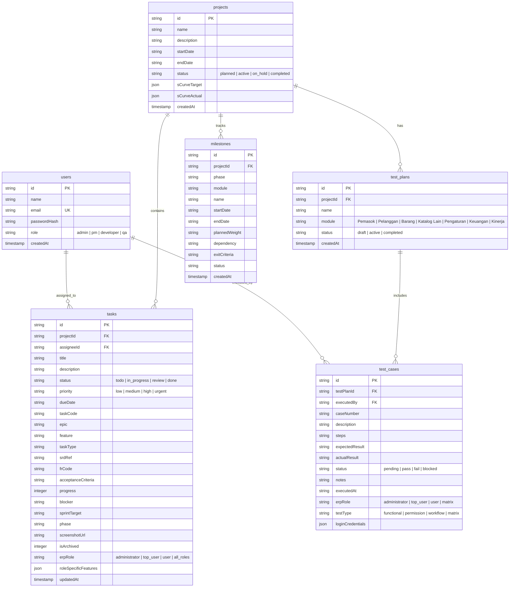

# Skema Database (Database Schema)

Sistem ERP PM & QA menggunakan database SQLite lokal (`erp_pm.db`) yang dimodelkan melalui **Drizzle ORM**.

---

## 📊 Diagram Entitas Hubungan (ERD)

Di bawah ini adalah diagram hubungan antar tabel yang dirender secara otomatis menggunakan Mermaid.js:

---

## 🗄️ Lokasi Kode Skema
Seluruh skema di atas didefinisikan dalam kode TypeScript menggunakan library Drizzle ORM pada berkas:
📂 `src/db/schema.ts`
