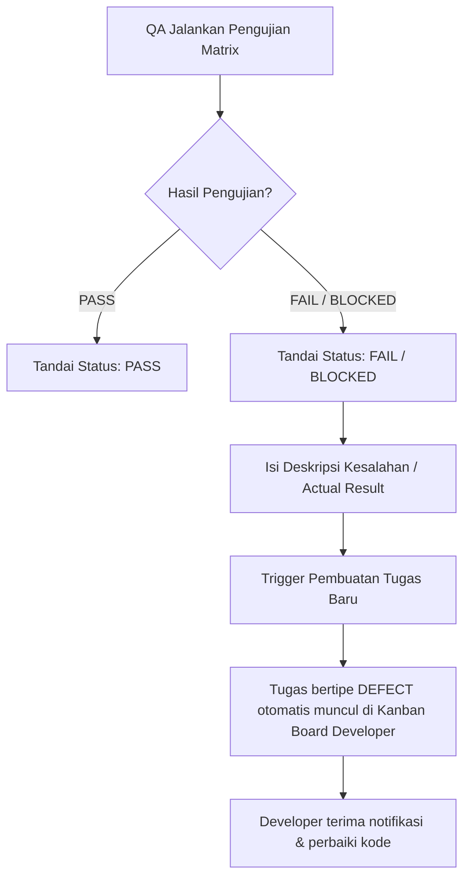

# Konsol Pengujian QA (QA Matrix Testing)

Konsol QA memfasilitasi pengujian fungsionalitas dan hak akses secara mendalam pada modul operasional ERP target dengan pendekatan **Role-Based Matrix Testing**.

---

## 🧪 Konsep Matrix Testing

Berbeda dengan pengujian perangkat lunak tradisional di mana satu *test case* hanya memvalidasi satu aksi pengguna tunggal, **Matrix Testing** memvalidasi skenario yang sama di bawah 3 peran pengguna ERP sekaligus dalam satu baris skenario pengujian:
1.  **Administrator**: Hak akses penuh (melihat, menambah, mengedit, menghapus).
2.  **Top User**: Hak akses menengah (misal: hanya melihat dan menambah tanpa tombol edit/hapus).
3.  **User**: Hak akses terbatas (misal: hanya melihat data).

Konsol QA menyajikan kredensial masuk yang terintegrasi untuk masing-masing peran ini agar penguji dapat langsung menyalin kredensial saat melakukan eksekusi uji coba.

---

## 📄 Laporan PDF (`jsPDF`)
Sistem menyediakan tombol unduhan laporan untuk menyusun berkas PDF resmi dari Test Plan & Test Case.
*   Menggunakan pustaka **jsPDF** dan **jsPDF-AutoTable** untuk menata hasil pengujian menjadi tabel rapi.
*   Menghitung tingkat kelulusan pengujian (*pass rate*) secara otomatis pada header laporan sebelum dicetak.

---

## 🤖 Alur Defect Otomatis (Automated Defect Loop)

Untuk mempercepat siklus koreksi kode pengembang, konsol QA memiliki fitur *Defect Loop* otomatis:

Fitur ini menjamin bahwa setiap temuan bug oleh QA tidak akan terlewatkan dan langsung masuk ke antrean kerja developer dalam bentuk tiket backlog yang siap ditangani.
